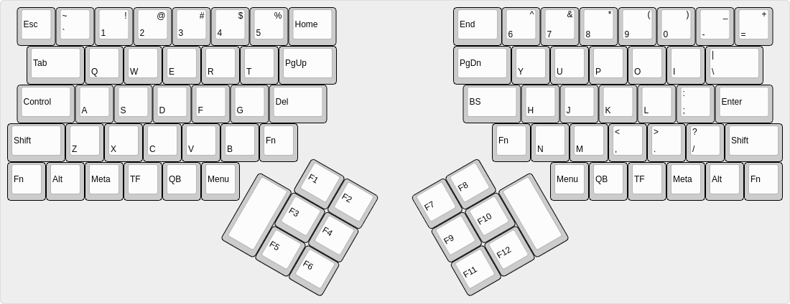
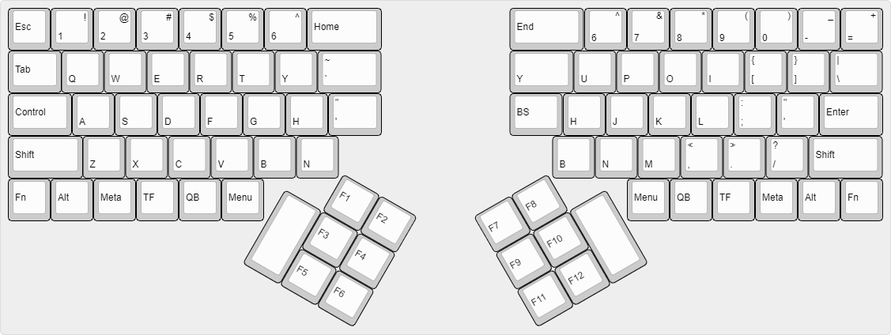

# Keyboard Designs

My keyboard designs. Free to use it in your project.

[中文版本](README.zh_CN.md)

# Splite Keyboard version 3

This is my current design. 

Layout updated for more suitable left/right hand usage.

Details in [V3 README.md](Splite-Keyboard-v3/README.md)

# Splite Keyboard version 2

    Sorry for the typo of filename...but that's why I need to build new keyboard (this project): my HHKB did not work perfect when weather changed frequently, and key missing happened a lot.

# Folder layout

* `${project name}-${version}` : keyboard design files, include KiCad/Layout/XML/JSON... 
* `${project name}-${version}.output` : factory product files. PCB/CNC/3D Print...

[MIT License](LICENSE)