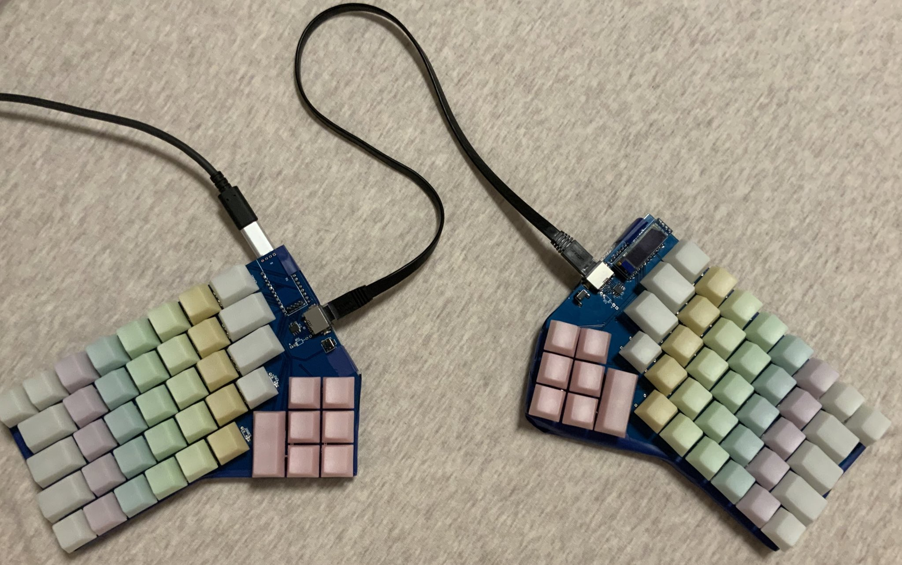
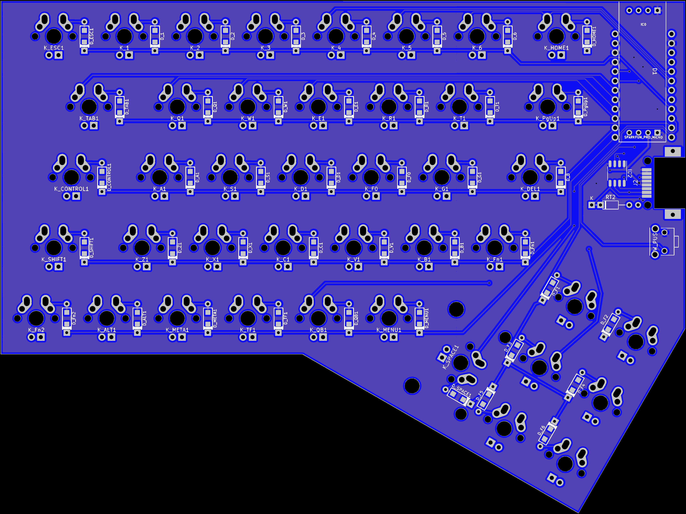
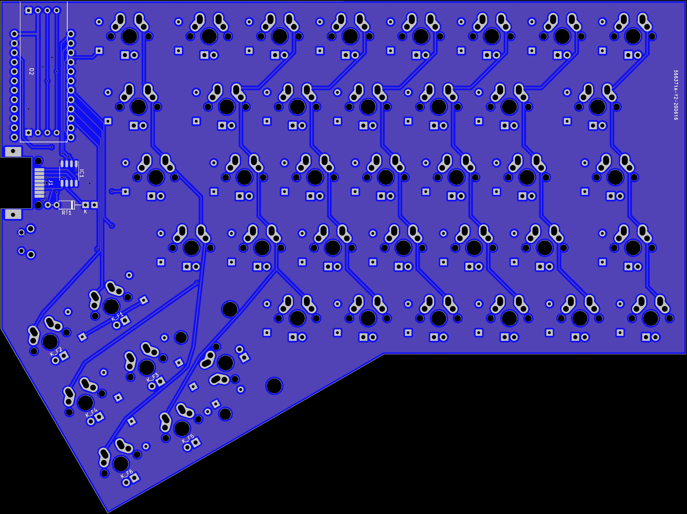

# Splite Keyboard v3 Design

## Layout


## Complete 



## Parts list

* MX compatible switchs * 84 (42 each hand)
* diode * 84
* Sparkfun Micro Pro * 2
* TI SN75179BDRG4 * 2 (RS422/SMD)
* MJ88-B011-HLSV6-P * 2 (RJ45/SMD)
* Ethernet Cable * 1 (Cat5e or up)
* IIC OLED Panel * 2 (optional)

## PCB Preview

PCB designed symmetrical.

Top View:



Bottom View:



## Used Software

```
    Application: KiCad
    Version: (5.99.0-2039-g05a89863c), release build
    Libraries:
        wxWidgets 3.0.5
        libcurl/7.70.0 OpenSSL/1.1.1g zlib/1.2.11 libidn2/2.3.0 libpsl/0.21.0 (+libidn2/2.2.0) libssh2/1.9.0 nghttp2/1.41.0
    Platform: Linux 5.7.6-arch1-1 x86_64, 64 bit, Little endian, wxGTK
    Build Info:
        Build date: Jun 26 2020 18:46:32
        wxWidgets: 3.0.5 (wchar_t,wx containers,compatible with 2.8) GTK+ 3.24
        Boost: 1.72.0
        OCC: 7.4.0
        Curl: 7.70.0
        Compiler: GCC 10.1.0 with C++ ABI 1014

    Build settings:
        KICAD_SCRIPTING=ON
        KICAD_SCRIPTING_MODULES=ON
        KICAD_SCRIPTING_PYTHON3=ON
        KICAD_SCRIPTING_WXPYTHON=ON
        KICAD_SCRIPTING_WXPYTHON_PHOENIX=ON
        KICAD_SCRIPTING_ACTION_MENU=ON
        BUILD_GITHUB_PLUGIN=ON
        KICAD_USE_OCC=ON
        KICAD_SPICE=ON
```

## Next Plan

* Design keyboard framework
